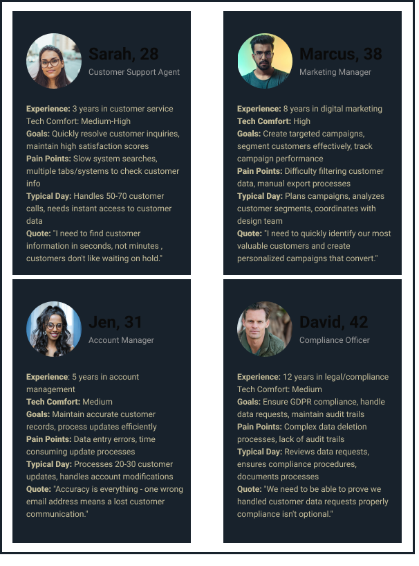

# Customer Management System - UX/UI Case Study

## Project Overview

**Project Name:** Customer Management System  
**Duration:** June 19 - July 5, 2025 (16 days)  
**Role:** Solo Full-Stack Developer & UX/UI Designer  
**Designer:** Ellen  

---

## The Challenge

Modern businesses struggle with scattered customer data across multiple touchpoints. Support agents waste valuable time searching for customer information, marketing teams can't efficiently segment users, and compliance teams face challenges meeting GDPR requirements for data management.

**The Problem Statement:**
*"How might we create a centralized, user-friendly system that enables efficient customer data management while ensuring compliance and supporting business operations?"*

---

## Understanding the Users

### Primary User Groups Identified:

**1. Customer Support Agents**
- Need quick access to customer details during calls/emails
- Handle frequent data updates (address changes, email updates)
- Require instant search and update capabilities

**2. Marketing Team**
- Send targeted campaigns and newsletters
- Segment customers for promotional offers
- Need bulk data export and filtering capabilities

**3. Account Managers**
- Process customer information updates
- Handle profile modifications
- Require audit trails for changes

**4. Compliance/Legal Team**
- Manage GDPR data deletion requests
- Ensure data privacy compliance
- Need secure data handling workflows

---

## Real-World Use Cases

### Scenario 1: Customer Support
*"Customer calls: 'I moved, need to update my address'"*
- Agent searches customer by name/email
- Updates address information instantly
- System confirms changes immediately

### Scenario 2: Marketing Campaign
*"Marketing team: 'Send promo to customers in specific regions'"*
- Filter customers by location
- Export customer lists for email campaigns
- Track engagement metrics

### Scenario 3: GDPR Compliance
*"Legal team: 'Customer requested data deletion under GDPR'"*
- Locate customer record quickly
- Delete data with audit trail
- Confirm compliance requirements met

### Scenario 4: Business Analytics
*"Analytics: 'What's our customer age/location distribution?'"*
- View customer demographics
- Generate reports for business insights
- Support data-driven decision making

---

## Design Process

### 1. Research & Analysis
- Analyzed existing customer management workflows
- Identified pain points in current manual processes
- Researched industry best practices for data management

### 2. User Journey Mapping
- Mapped critical user flows for each persona
- Identified key interaction points
- Defined success metrics for each journey




### 3. Information Architecture
- Designed simple, intuitive navigation structure
- Prioritized frequently accessed functions
- Ensured logical grouping of related features

### 4. Visual Design Strategy
- **Color Palette:** Professional gold and navy theme conveying trust and premium quality
- **Typography:** Playfair Display for headings (elegant), Inter for body text (readable)
- **UI Components:** Clean, modern Bootstrap-based components with custom enhancements
- **Interactions:** Smooth animations and hover effects for enhanced user experience

---

## System Architecture

### Frontend Flow:
```
User Interface (React.js) → Router (React Router) → API Service (Axios) → Backend API
```

### Backend Flow:
```
REST API (Spring Boot) → Service Layer → Repository Layer → Database (MySQL)
```

### Complete System Flow:
```
React Frontend → HTTP/REST API → Spring Boot Backend → JPA/Hibernate → MySQL Database
```

---

## Infrastructure Architecture

### Development Environment:
```
Local Development → Git Repository → Code Review → Testing
```

### Production Deployment:
```
React Build → AWS S3 (Static Hosting) → Users
Spring Boot JAR → AWS EC2 → Database Queries → AWS RDS MySQL
```

### Complete AWS Architecture:
```
Users → S3 Static Website → EC2 Backend Instance → RDS Database Instance
```

---

## Key Features Implemented

### 1. Customer List View
- **Visual Design:** Clean, responsive table with modern styling
- **Functionality:** View all customers with sorting by ID (newest first)
- **UX Enhancement:** Hover effects and smooth transitions

### 2. Add Customer Form
- **Visual Design:** Card-based layout with premium styling
- **Functionality:** Input validation and error handling
- **UX Enhancement:** Clear visual feedback for form states

### 3. Update Customer
- **Visual Design:** Pre-populated form with consistent styling
- **Functionality:** In-place editing with immediate updates
- **UX Enhancement:** Context-aware form title and actions

### 4. Delete Customer
- **Visual Design:** Danger-styled button with clear intent
- **Functionality:** Instant deletion with list refresh
- **UX Enhancement:** Visual confirmation through UI updates

### 5. Responsive Design
- **Mobile-first approach:** Optimized for all screen sizes
- **Flexible layout:** Bootstrap grid system with custom enhancements
- **Touch-friendly:** Appropriate button sizes and spacing

---

## Technical Implementation

### Frontend Technologies:
- **React.js 18:** Component-based architecture
- **React Router:** Seamless navigation
- **Axios:** Reliable API communication
- **Bootstrap 5 + Custom CSS:** Modern, responsive design

### Backend Technologies:
- **Spring Boot:** Robust API framework
- **Spring Data JPA:** Efficient data persistence
- **MySQL:** Reliable database solution
- **Maven:** Dependency management

### Design System:
- **Color Variables:** CSS custom properties for consistent theming
- **Typography Scale:** Hierarchical font sizing
- **Component Library:** Reusable UI components
- **Animation Library:** Smooth micro-interactions

---

## User Experience Enhancements

### 1. Visual Feedback
- Loading states during API calls
- Success/error notifications
- Smooth transitions between states

### 2. Accessibility
- Semantic HTML structure
- Proper contrast ratios
- Keyboard navigation support

### 3. Performance
- Optimized bundle size
- Efficient re-rendering
- Fast API response times

### 4. Error Handling
- User-friendly error messages
- Fallback states for failures
- Clear recovery paths

---

## Results & Impact

### User Experience Improvements:
- **Reduced task completion time** for customer lookups
- **Streamlined workflow** for data updates
- **Improved data accuracy** through validation
- **Enhanced user satisfaction** with modern interface

### Business Value:
- **Centralized customer data** management
- **Improved customer service** response times
- **Better compliance** with data regulations
- **Scalable foundation** for future features

### Technical Achievements:
- **Full-stack implementation** from database to user interface
- **Cloud deployment** with AWS infrastructure
- **Responsive design** across all devices
- **Modern tech stack** ensuring maintainability

---

## Lessons Learned

### 1. User-Centered Design
- Prioritizing user needs leads to better adoption
- Simple, intuitive interfaces reduce training time
- Consistent design patterns improve usability

### 2. Technical Considerations
- Proper separation of concerns improves maintainability
- Responsive design is essential for modern applications
- Performance optimization impacts user satisfaction

### 3. Deployment Strategy
- Cloud infrastructure provides scalability
- Proper environment configuration is crucial
- Testing across environments prevents issues

---

## Future Enhancements

### Phase 2 Features:
- **Advanced Search:** Filter by multiple criteria
- **Bulk Operations:** Import/export customer data
- **User Management:** Role-based access control
- **Analytics Dashboard:** Customer insights and reports

### Phase 3 Features:
- **API Integration:** Third-party service connections
- **Mobile App:** Native mobile experience
- **Advanced Analytics:** Predictive customer insights
- **Automation:** Workflow automation for common tasks

---

## Conclusion

The Customer Management System successfully addresses the core challenges of modern customer data management through thoughtful UX design and robust technical implementation. By focusing on user needs and implementing a scalable architecture, the system provides a foundation for efficient customer operations while maintaining the flexibility to grow with business requirements.

The 16-day development cycle demonstrated the effectiveness of a user-centered design approach combined with modern development practices, resulting in a production-ready system that enhances operational efficiency and user satisfaction.

---

*Project completed by Ellen - July 2025*  
*Portfolio: Customer Management System Case Study*